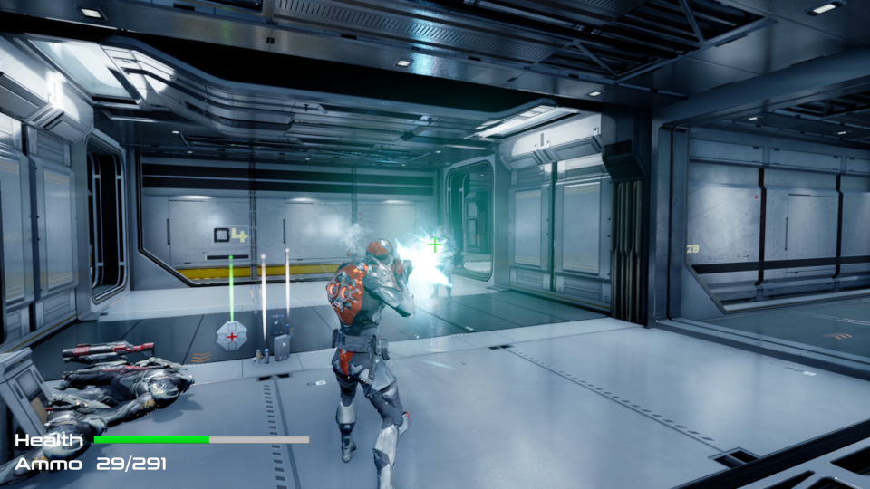
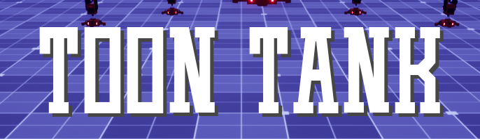

<!-- Two -->
<section id="two" class="spotlights">
	<section>
		
		

			

				<header class="major">
					<h3>Paragon Shooter</h3>
				</header>
				
Paragon Shooter is a 3rd person shooter game demo I made in Unreal Engine 4. 

				<ul class="actions">
					<li><a href="paragon-shooter.html" class="button">Learn more</a></li>
				</ul>
			

		

	</section>
	<section>
		
		

			

				<header class="major">
					<h3>Toon Tank</h3>
				</header>
				
Toon Tank is an arcade style tank combat game. You control a little tank to take on missile-shooting enemy turrets. You goal is to destroy all the enemies. It's simple yet satisfying to play!

				<ul class="actions">
					<li><a href="toon-tank.html" class="button">Learn more</a></li>
				</ul>
			

		

	</section>
	<section>
		
		

			

				<header class="major">
					<h3>Building Escape - Tech Demo</h3>
				</header>
				
Building Escape is a tech demo made in Unreal Engine 4. It is a dungeon puzzle game that requires the player to solve the hidden puzzle and escape the dungeon.

				<ul class="actions">
					<li><a href="building_escape.html" class="button">Learn more</a></li>
				</ul>
			

		

	</section>
	<section>
		
		

			

				<header class="major">
					<h3>Portals - Tech Demo</h3>
				</header>
				
I used Unity to recreate the portal effects from the famous Portal series. You can see through as well as walk through the portals. 

				<ul class="actions">
					<li><a href="../2020/05/23/portals.html" class="button">Learn more</a></li>
				</ul>
			

		

	</section>
</section>

