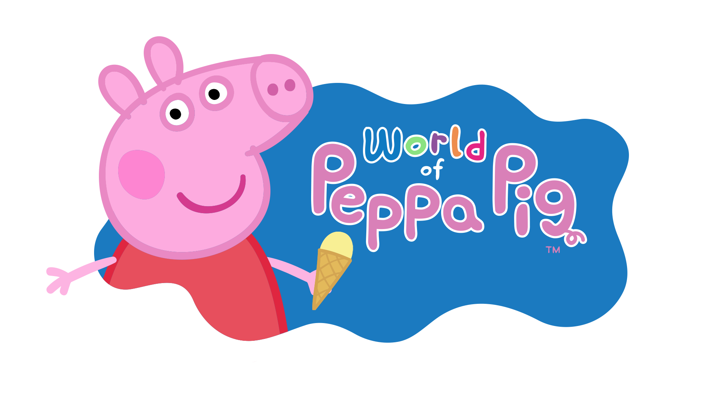

<!-- Main -->

<!-- Two -->
<section id="two" class="spotlights">
	<section>
		
		

			

				<header class="major">
					<h3>World of Peppa Pig App</h3>
				</header>
				
World of Peppa Pig is a mobile game that contains a list of fun and educational mini games. I am working on the game as a Unity developer. I work closely with the game designer and artists to implement new mini games and improve on existing mini games. I have worked on several mini games, some partially and some developed from scratch.
				 Other work includes:

				<ul>
					<li>Game architectural improvement</li>
					<li>Optimization and memory management</li>
					<li>Reusable Prefabs development</li>
					<li>Bug fixes</li>
				</ul>
				<ul class="actions">
					<li><a href="https://www.peppapig.com/world-of-peppa-pig/" class="button">Learn more</a></li>
				</ul>
			

		

	</section>
</section>
